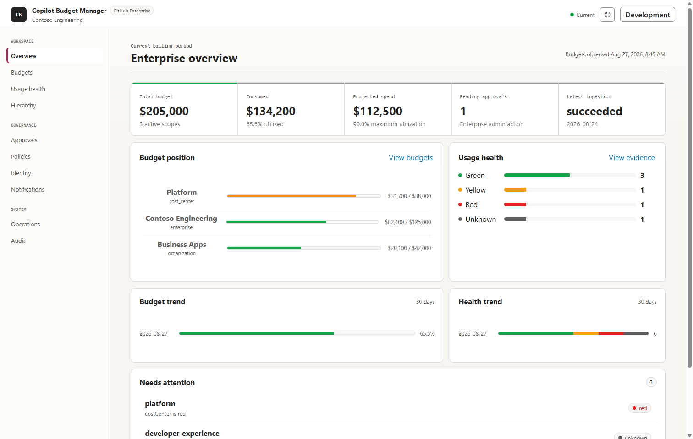

# GitHub Copilot Budget Manager

[](https://github.com/johnsont1693/GitHubCopilotBudgetManager/actions/workflows/ci.yml)
[](LICENSE)
[](global.json)
[](infra/README.md)
[](CHANGELOG.md)

See where Copilot spend is heading, tell the accountable people before a budget runs out,
and change budgets through an approval trail instead of a spreadsheet.

GitHub Copilot Budget Manager is an open-source, customer-deployed system for monitoring
GitHub Copilot adoption and financial usage, classifying usage health, notifying
accountable people, and safely managing GitHub budgets through the GitHub REST API.

> [!NOTE]
> This is a community-supported reference implementation, not an official GitHub product, a hosted service, or a product with an SLA. Each customer owns its deployment, configuration, approvals, operating controls, and Azure costs. See [SUPPORT.md](SUPPORT.md).



<sub>The dashboard follows the operating system light or dark preference. A
[dark theme capture](docs/images/dashboard-dark.png) is also included.</sub>

## What it does

- **Shows whether you will run out.** Burn-rate forecasting with an explainable projection
  per enterprise, organization, cost center, and repository.
- **Classifies usage health.** Weighted and precedence rules produce Green, Yellow, or Red,
  and a distinct `Unknown` when the data is missing, suppressed, or stale.
- **Notifies the accountable owner.** Deduplicated routing to mapped users, owners, and
  enterprise admins over Outlook, with Teams optional.
- **Changes budgets safely.** Guardrails, enterprise-admin approval, and a re-read of the
  live GitHub budget immediately before any write.
- **Keeps the evidence.** Immutable snapshots, an append-only audit trail, deterministic
  CSV exports, and durable retention and reconciliation history.

## Recommended budget-management standard

This repository demonstrates an operating model, not merely an automation script:

1. **Observe before changing.** Synchronize GitHub's authoritative amount and consumed
  spend in read-only mode.
2. **Classify uncertainty explicitly.** Missing, stale, suppressed, or future-dated inputs
  produce `Unknown`; they are never treated as evidence of poor performance or permission
  to spend.
3. **Make the proposal reproducible.** Persist the forecast inputs, deterministic
  fingerprint, guardrail decision, and evidence used to calculate an increase.
4. **Separate proposal, approval, and execution.** An enterprise administrator reviews the
  evidence; a Worker—not a browser request—owns the external write.
5. **Require multiple independent gates.** GitHub App permission, approval state,
  `BUDGET_WRITES_ENABLED`, amount/percentage/cumulative limits, freshness, cooldown, and
  health must all permit the operation.
6. **Revalidate at the point of write.** Re-read GitHub immediately before the amount-only
  `PATCH`; any drift ends as a conflict rather than overwriting another administrator.
7. **Verify and retain evidence.** Persist the resulting GitHub response, immutable budget
  snapshot, execution status, and append-only audit event, then monitor failed jobs and
  reconcile baselines on a controlled schedule.

Adopters can replace hosting or delivery adapters, but should preserve these boundaries.

> [!IMPORTANT]
> The software is deployable but requires customer-owned Azure, Microsoft Entra, GitHub App, SQL identity, and Microsoft 365 connector configuration. Start in read-only mode and validate the staging environment before granting the GitHub App write access.

## Quickstart

Explore the product locally against seeded demo data. No Azure subscription, GitHub App, or
credentials are required.

```powershell
dotnet restore GitHubCopilotBudgetManager.slnx
dotnet run --project src/BudgetManager.Api/BudgetManager.Api.csproj
```

Open `http://127.0.0.1:5088/`. Development mode seeds a local SQLite database and disables
authentication, and both happen only when `ASPNETCORE_ENVIRONMENT=Development`.
Production requires Azure SQL and Microsoft Entra configuration; local demo settings are
intentionally rejected outside Development. Continue with the
[Azure deployment guide](infra/README.md) only after the demo is understood.

Review every background command, including its required environment variables and safety
boundaries, without configuring anything:

```powershell
dotnet run --project src/BudgetManager.Worker -- --help
```

## Capabilities

<details>
<summary>Full implemented capability list</summary>

- Weighted Green/Yellow/Red classification with higher-is-better and lower-is-better metrics.
- Ordered precedence rules where the first matching rule determines status.
- A distinct `Unknown` status for missing, suppressed, stale, or future-dated required data.
- Budget increase guardrails for per-change amount and percentage, cumulative monthly increases, forecast headroom, stale data, duplicate windows, and cooldowns.
- ASP.NET Core endpoints that exercise each evaluator with versioned JSON contracts.
- A typed GitHub enterprise budget client for list, get, and minimal amount-only `PATCH` operations.
- Mandatory GitHub media type, REST API version, bearer token, user-agent, HTTPS, pagination, and safe error handling.
- Focused domain and GitHub contract tests plus a GitHub Actions build.
- GitHub App RS256 authentication and expiry-aware installation-token caching.
- Typed enterprise clients for Copilot reports, cost centers, billing exports, budgets, and user states.
- Azure SQL persistence, EF Core migrations, immutable metric/budget/forecast snapshots, approvals, outbox, audit, identity mappings, and retention settings.
- T-3 report ingestion with signed-host allowlisting, bounded downloads, Blob archival, NDJSON normalization, hierarchy/membership capture, daily team attribution, additive repository rollups, and correction-window replacement.
- Explainable burn-rate forecasting, persistent classifications, guarded budget proposals, admin approvals, drift-aware GitHub writes, and monthly baseline reconciliation.
- Microsoft Graph identity enrichment through a deployer-selected GitHub-login attribute.
- Service Bus outbox delivery, Outlook-only individual notifications, disabled-by-default Logic Apps Teams/Outlook workflow, and Power Automate templates.
- Entra JWT/app-role protected administration API and responsive operational dashboard with PKCE sign-in, explainable evidence views, deterministic CSV exports, delivery status, financial metadata, and retention/reconciliation safety history.
- Azure Commercial deployment through `azd`, AVM-based Bicep, managed identities, private endpoints, backups, monitoring, OIDC deployment, and scheduled Container Apps Jobs.

</details>

## Intended deployment

Each customer will deploy one isolated instance into its own Azure Commercial subscription for one GitHub Enterprise Cloud enterprise. GitHub remains authoritative for billing entities, consumed amounts, cost centers, and effective budgets. This application will own classifications, forecasts, notifications, approvals, and audit history.

The Azure Commercial deployment layer now provisions Azure Container Apps, Azure Static Web Apps, Azure SQL Database, Blob Storage, Service Bus, Key Vault, Microsoft Entra ID integration points, Logic Apps, Application Insights, `azd`, and Bicep. See [infra/README.md](infra/README.md) for the two-stage deployment and required tenant onboarding.

## Use one automation capability

The full Azure deployment is not required when only one automation is needed. The Worker exposes independent commands, and the scripts provide validated capability-level entry points:

- [Automate budget increases](docs/how-to-automate-budget-increases.md) with GitHub, SQL, and the approval API. The dashboard, Graph, Blob Storage, Service Bus, and Microsoft 365 workflow are optional.
- [Send notification email](docs/how-to-send-notification-emails.md) from existing health classifications with SQL, Service Bus, and a tenant-owned Outlook flow. The dashboard, GitHub budget write permission, and Graph are optional.

See [Modular automation](docs/modular-automation.md) for the component matrix, source boundaries, optional integrations, and extraction guidance. Run `dotnet run --project src/BudgetManager.Worker -- --help` or inspect [scripts/README.md](scripts/README.md) without configuring cloud credentials.

## Prerequisites

- .NET SDK 10.0.400 or a compatible 10.0 patch selected by [global.json](global.json).
- Git 2.40 or later.

The dashboard intentionally uses browser-native modules and CSS, so no local JavaScript package installation is required.

## Build and test

```powershell
dotnet restore GitHubCopilotBudgetManager.slnx
dotnet tool restore
dotnet build GitHubCopilotBudgetManager.slnx --configuration Release --no-restore
dotnet test GitHubCopilotBudgetManager.slnx --configuration Release --no-build
az bicep build --file infra/main.bicep --stdout | Out-Null
Get-ChildItem src/dashboard -Filter *.js | ForEach-Object { node --check $_.FullName }
```

## API surface

Representative endpoints are:

- `GET /healthz`
- `GET /readyz`
- `GET /api/v1`
- `GET /api/v1/dashboard/overview`
- `GET /api/v1/budgets`, `/classifications`, `/hierarchy`, `/forecasts`, `/policies`, `/identity-mappings`, `/notifications`, `/operations/ingestions`, `/operations/billing-exports`, `/operations/safety-history`, and `/audit`
- `GET /api/v1/exports/audit.csv`, `/exports/classifications.csv`, and `/exports/identity-mappings.csv`
- `POST /api/v1/operations/retention-preview` and `/budget-baselines/reconciliation-preview`
- `POST /api/v1/budget-change-requests` and admin approval/rejection callbacks
- `POST /api/v1/evaluations/classifications/weighted`
- `POST /api/v1/evaluations/classifications/precedence`
- `POST /api/v1/evaluations/budget-increases`

The evaluation routes are a policy simulation harness. Production scheduled classification uses persisted policies and observations. GitHub budget execution is worker-only; the browser/API cannot directly issue a GitHub `PATCH`.

## Safety principles

- Start every deployment in read-only and dry-run mode.
- Keep `BUDGET_WRITES_ENABLED=false` until staging validation, guardrail review, approval
  governance, and GitHub App permission review are complete.
- Treat incomplete telemetry as unknown instead of inferring poor performance.
- Keep GitHub's `effective_budget` response authoritative.
- Require enterprise-admin approval by default for budget changes.
- Re-fetch and compare a budget immediately before any future `PATCH`.
- Never describe Copilot usage or pull-request correlations as causal productivity measurements.

See [docs/architecture.md](docs/architecture.md) for the initial boundaries and data flow.

## Documentation

- [Architecture](docs/architecture.md)
- [Metric catalog and interpretation](docs/metrics.md)
- [Permissions](docs/permissions.md)
- [Security and threat model](docs/security.md)
- [Privacy and retention](docs/privacy.md)
- [Operations and recovery](docs/operations.md)
- [Known limitations](docs/known-limitations.md)
- [Modular automation](docs/modular-automation.md)
- [How to automate budget increases](docs/how-to-automate-budget-increases.md)
- [How to send notification email](docs/how-to-send-notification-emails.md)
- [Automation scripts](scripts/README.md)
- [Azure deployment](infra/README.md)
- [Power Automate workflow](deploy/power-automate/README.md)
- [Changelog](CHANGELOG.md)

## Contributing, support, and security

- Getting help, and what never to paste into an issue: [SUPPORT.md](SUPPORT.md)
- Development workflow and required checks: [CONTRIBUTING.md](CONTRIBUTING.md)
- Community expectations: [CODE_OF_CONDUCT.md](CODE_OF_CONDUCT.md)
- Reporting a vulnerability: [SECURITY.md](SECURITY.md). Never open a public issue for a
  suspected vulnerability.

## License

Licensed under the [MIT License](LICENSE).