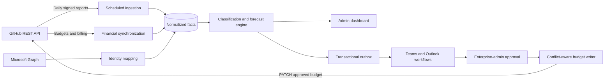

# Architecture

## Authority boundaries

The system separates three sources of authority:

1. **GitHub** owns billing entities, assigned seats, consumed usage, cost-center membership, budget values, enforcement flags, and the effective budget selected by GitHub.
2. **Microsoft Entra ID** enriches mapped GitHub identities for private Outlook delivery and accountable-owner routing; shared Teams delivery is aggregate-only.
3. **Budget Manager** owns metric definitions, data-quality assessments, health classifications, forecasts, notification history, approval state, automation guardrails, and audit evidence.

The application must display GitHub's `effective_budget` result rather than attempting to recreate undocumented precedence behavior.

## Data flow

Copilot usage data is scheduled, not webhook-driven. Daily ingestion defaults to T-3 and report partitions are replaceable so corrections can be reprocessed without duplicate facts.

Report normalization preserves enterprise, organization, team, repository, and user entities plus dated membership edges. Team metrics join user observations to memberships for the same report day, so current team membership cannot rewrite historical attribution. Repository metrics roll up to organizations only for an explicit additive allowlist; medians and other non-additive measures remain at their source scope.

Financial synchronization stores immutable budget, cost-center, resource-membership, user-state, and billing-export metadata snapshots. Time-limited GitHub billing download URLs are used in memory and are never persisted. GitHub remains authoritative for budget and billing values.

## Runtime boundaries

- **API:** Entra-protected administration reads and commands. It can create proposals and decisions but cannot execute GitHub writes.
- **Worker jobs:** Migration, GitHub synchronization, report ingestion, identity enrichment, classification, forecast, baseline reconciliation, retention, approved writes, and outbox dispatch.
- **Domain:** Pure classification, forecast, guardrail, lifecycle, and reconciliation decisions.
- **Infrastructure:** GitHub/Graph/Azure clients and EF Core stores.
- **Dashboard:** Static browser application using Entra authorization code with PKCE and delegated API tokens.

Evidence reads select the latest state per entity before applying status filters. Classification details retain policy inputs, observations, reasons, freshness, and fingerprints. CSV exports escape spreadsheet formulas and include per-row and whole-document SHA-256 hashes. Retention and baseline reconciliation previews persist their complete decisions as append-only audit evidence before any apply path is considered.

## Capability boundaries

Budget automation and notification delivery share persistence but not orchestration:

- Budget automation uses the guardrail evaluator, proposal service, approval repository,
  GitHub budget client, and approved-request executor. It does not require classification,
  report ingestion, Graph, Service Bus, Microsoft 365 connectors, or the dashboard. Budget
  lifecycle outbox events can be disabled while immutable audit remains enabled.
- Notification automation uses classification signals, recipient resolution, the
  transactional outbox, Service Bus publisher, and a tenant-owned sender. It does not
  require the API, dashboard, or GitHub budget write permission. Graph is optional when
  owner or admin recipients are sufficient.
- The Worker commands are independent composition roots. Each command registers and
  validates only the clients and configuration it uses.

The source projects are shared packages rather than separately published capability
packages. The supported lightweight entry points and extraction manifest are documented in
[Modular automation](modular-automation.md).

## Azure topology

- Azure Static Web Apps Standard for the administration client.
- Azure Container Apps for the authenticated API and queue-driven worker.
- Azure Container Apps Jobs for scheduled ingestion, synchronization, retention, and reconciliation.
- Azure SQL Database for relational facts and transactional state.
- Azure Blob Storage for raw reports and exports.
- Azure Service Bus plus an SQL outbox for reliable notifications and optional budget lifecycle events; GitHub writes remain direct, approval-gated Worker operations.
- Azure Key Vault and managed identities for credentials and service access.
- Azure Logic Apps for Teams, Outlook, and approval orchestration.
- Application Insights, Log Analytics, and Azure Monitor for telemetry; customer-owned alert rules are a required post-deploy operation.

Infrastructure is delivered through `azd` and pinned Azure Verified Modules. Production defaults use a single Azure region with optional zone redundancy, geo-redundant SQL/Blob backups, private data-plane endpoints, managed identity, and a public HTTPS administration plane protected by Entra.

## External references

- GitHub REST API: https://docs.github.com/en/rest
- Copilot usage metrics: https://docs.github.com/en/rest/copilot/copilot-usage-metrics
- GitHub budgets: https://docs.github.com/en/enterprise-cloud@latest/rest/billing/budgets
- Azure Container Apps: https://learn.microsoft.com/azure/container-apps/overview
- Azure Static Web Apps: https://learn.microsoft.com/azure/static-web-apps/overview