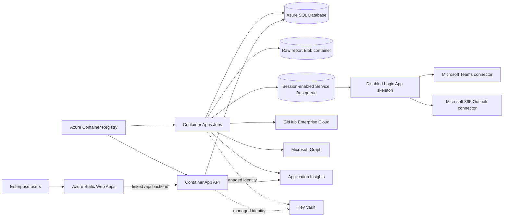

# Azure Commercial deployment

This directory deploys one customer-owned GitHub Copilot Budget Manager instance for one GitHub Enterprise Cloud enterprise. It targets Azure Commercial only and does not create tenant-level Microsoft Entra or GitHub resources.

No deployment is performed by this repository automatically. The GitHub Actions workflow is manual, uses OpenID Connect (OIDC), and requires an explicitly configured GitHub Environment.

## Topology



The Container Apps environment uses a delegated VNet subnet. A separate subnet hosts private endpoints for ACR, Blob Storage, Azure SQL, and Key Vault. Service Bus also has a private endpoint, but its public network endpoint remains enabled behind a default-deny firewall with trusted-service access so the multitenant Logic Apps connector can receive events. Replacing the Consumption Logic App with a VNet-integrated Logic App Standard removes that exception at additional cost.

Static Web Apps and the API HTTPS ingress remain public by design. API authorization is still enforced with Microsoft Entra JWT bearer tokens.

## Resources

The root template uses pinned Azure Verified Modules (AVM) for:

- User-assigned managed identities for runtime, migration, and notifications.
- Azure Container Registry, Container Apps environment, API Container App, and eleven Container Apps Jobs.
- Azure SQL logical server and General Purpose database.
- Storage account and private raw-report container.
- Service Bus namespace and session-enabled workflow queue.
- Key Vault, Log Analytics, Application Insights, Static Web App, VNet, and Logic App workflow.

Direct ARM resources are limited to private DNS zones, VNet links, and managed API connection shells that are not independently covered by the selected AVM modules.

## Cost and deployment profiles

Review current Azure pricing with the customer before provisioning. The secure default
`enablePrivateEndpoints=true` forces Premium tiers for Azure Container Registry and Service
Bus; Service Bus Premium is normally the largest fixed cost in this topology. Static Web
Apps Standard is selected when application resources are enabled so its Container Apps
backend can be linked. Azure SQL defaults to General Purpose serverless and may add resume
latency after an idle period.

For a lower-cost demonstration, `enablePrivateEndpoints=false` permits lower service tiers,
but it changes the network boundary: data-plane public endpoints remain reachable and rely
on Microsoft Entra, managed identity, TLS, disabled local authentication, and service
firewalls instead of private connectivity. Treat that as an explicit customer security
decision, not a transparent cost optimization. Do not present either profile as having a
fixed monthly price; region, telemetry volume, SQL activity, retention, and job frequency
materially change cost.

## Security defaults

- Managed identity is used for ACR pull, Azure SQL, Blob, Service Bus, Key Vault, Microsoft Graph, and Application Insights ingestion.
- Storage shared-key access, Service Bus local authentication, ACR admin access, and Application Insights local authentication are disabled.
- SQL permits Microsoft Entra authentication only.
- ACR, Blob, SQL, and Key Vault public network access is disabled when `enablePrivateEndpoints` is true.
- Key Vault purge protection and 90-day soft delete are enabled.
- Blob versioning, blob/container soft delete, infrastructure encryption, HTTPS-only access, and a raw-report lifecycle rule are enabled.
- SQL point-in-time retention, monthly long-term retention, and geo-redundant backup storage are configurable.
- The GitHub App private key is accepted only as a secure Bicep parameter or an existing Key Vault secret. It is never stored in this repository.
- The Logic App is deployed disabled. Teams and Outlook connections have no OAuth authorization until an operator completes it.
- Application resources default to off for a safe first provision. Images and SQL grants must exist before they are enabled.
- Approved budget execution has a separate `BUDGET_WRITES_ENABLED` switch that defaults to false; the executor job remains manual while it is false.
- The API uses the Azure Monitor OpenTelemetry distro with managed-identity ingestion. Worker commands emit structured lifecycle and failure logs to Container Apps console logs and Log Analytics.

## Prerequisites

- An Azure Commercial subscription with the resource providers used by the template registered.
- Azure CLI with Bicep, Azure Developer CLI (`azd`), Docker for local image builds, and .NET SDK 10 when validating locally.
- Permission to create resources and role assignments. The deployment OIDC principal normally needs `Contributor` and `User Access Administrator` on the target resource group. If the workflow creates the resource group, grant those roles at subscription scope or pre-create `rg-cbm-<environment>` and scope them there.
- A Microsoft Entra API app registration and an enterprise-admin group.
- A GitHub App owned by or installable on the target enterprise.
- A private network path for the SQL administrator to the deployment VNet, such as a peered admin VNet, VPN, or a temporary controlled administration host. SQL has no public endpoint in the default profile.

## Required inputs

`main.parameters.json` maps `azd` environment values into `main.bicep`. The following values have no silent product defaults:

| Value | Purpose |
| --- | --- |
| `AZURE_ENV_NAME` | Short environment name such as `prod` |
| `AZURE_LOCATION` | Primary Azure region |
| `GITHUB_ENTERPRISE_ID` | Stable application-owned GUID for this deployment; the current worker requires a GUID, not GitHub's numeric enterprise ID |
| `GITHUB_ENTERPRISE_SLUG` | GitHub Enterprise Cloud slug |
| `GITHUB_APP_ISSUER` | GitHub App client ID (preferred) or App ID used as the JWT issuer |
| `GITHUB_APP_INSTALLATION_ID` | Enterprise installation ID |
| `SQL_ADMIN_OBJECT_ID` | Object ID of the Entra user, group, or service principal configured as SQL administrator |
| `SQL_ADMIN_LOGIN` | Display name of that SQL administrator |
| `API_AUDIENCE` | API app registration client ID or Application ID URI expected in access tokens |
| `BUDGET_MAXIMUM_INCREASE_AMOUNT` | Maximum one-request increase in billing currency units |
| `BUDGET_MAXIMUM_INCREASE_PERCENT` | Maximum one-request percentage increase, 0–100 |
| `BUDGET_MAXIMUM_CUMULATIVE_MONTHLY_INCREASE` | Maximum monthly cumulative increase per budget |
| `BUDGET_FORECAST_HEADROOM_PERCENT` | Required forecast headroom percentage, 0–100 |
| `BUDGET_COOLDOWN_HOURS` | Minimum time between tool-applied increases |
| `BUDGET_MAXIMUM_DATA_AGE_HOURS` | Maximum age of proposal inputs |
| `DASHBOARD_CLIENT_ID` | Entra SPA application client ID used by the dashboard PKCE flow |
| `DASHBOARD_API_SCOPE` | Delegated API scope, such as `api://<api-client-id>/access_as_user` |
| `GRAPH_GITHUB_LOGIN_PROPERTY` | Graph user property or extension containing the GitHub login |
| `RAW_REPORT_RETENTION_DAYS` | Explicit customer retention choice, from 7 to 3650 days |

Sizing, schedules, backup retention, redundancy, tags, network prefixes, and SKUs are parameters in `main.bicep`. Override them with an environment-specific parameter file or add matching `azd env` bindings before provisioning.

## GitHub Actions OIDC

Create a GitHub Environment with the same name passed to the deployment workflow. Configure the Azure federated identity credential subject as:

```text
repo:<owner>/<repository>:environment:<environment-name>
```

For production, restrict that Environment to the default branch, require reviewer approval,
and prevent the initiator from approving their own deployment. Scope the federated identity
to this environment subject rather than to every branch in the repository. The workflow
sets the Azure token audience explicitly to `api://AzureADTokenExchange`.

Environment secrets:

| Secret | Purpose |
| --- | --- |
| `AZURE_CLIENT_ID` | OIDC application/service principal client ID |
| `AZURE_TENANT_ID` | Microsoft Entra tenant ID |
| `AZURE_SUBSCRIPTION_ID` | Azure subscription ID |
| `GH_APP_PRIVATE_KEY` | Complete GitHub App PEM private key; required only when application resources are enabled |

Environment variables:

| Variable | Purpose |
| --- | --- |
| `AZURE_LOCATION` | Azure region |
| `API_AUDIENCE` | API token audience |
| `BUDGET_APPROVAL_LIFETIME_HOURS` | Optional proposal expiry, 1–168; defaults to 48 |
| `BUDGET_COOLDOWN_HOURS` | Customer-approved minimum interval between increases |
| `BUDGET_FORECAST_HEADROOM_PERCENT` | Customer-approved forecast headroom, 0–100 |
| `BUDGET_MAXIMUM_CUMULATIVE_MONTHLY_INCREASE` | Customer-approved monthly cumulative ceiling |
| `BUDGET_MAXIMUM_DATA_AGE_HOURS` | Customer-approved financial-input freshness limit |
| `BUDGET_MAXIMUM_INCREASE_AMOUNT` | Customer-approved one-request amount ceiling |
| `BUDGET_MAXIMUM_INCREASE_PERCENT` | Customer-approved one-request percentage ceiling, 0–100 |
| `DASHBOARD_CLIENT_ID` | Dashboard SPA application client ID |
| `DASHBOARD_API_SCOPE` | Dashboard delegated API scope |
| `GH_ENTERPRISE_ID` | Application-owned enterprise GUID |
| `GH_ENTERPRISE_SLUG` | GitHub enterprise slug |
| `GH_APP_ISSUER` | GitHub App client ID or App ID |
| `GH_APP_INSTALLATION_ID` | GitHub App installation ID |
| `GRAPH_GITHUB_LOGIN_PROPERTY` | Graph login mapping property |
| `BUDGET_WRITES_ENABLED` | `false` by default; set `true` only through approved change control |
| `NOTIFICATION_CHANNELS` | `Outlook` or `Teams;Outlook` |
| `NOTIFICATION_RECIPIENTS` | Optional semicolon-separated aggregate recipients |
| `PUBLISH_BUDGET_LIFECYCLE_EVENTS` | Publish budget events to the outbox; defaults to `true` |
| `RAW_REPORT_RETENTION_DAYS` | Selected raw-report retention |
| `SQL_ADMIN_OBJECT_ID` | Entra SQL administrator object ID |
| `SQL_ADMIN_LOGIN` | Entra SQL administrator display name |
| `SQL_ADMIN_PRINCIPAL_TYPE` | `User`, `Group`, or `Application`; normally `Group` |
| `TEAMS_CHANNEL_ID` | Optional channel for the disabled workflow skeleton |
| `TEAMS_TEAM_ID` | Optional team for the disabled workflow skeleton |

Run **Deploy Azure Commercial** twice:

1. Run with `deployApplication=false`. This creates the data plane, identities, ACR, monitoring, networking, Static Web App, and disabled Logic App.
2. Complete the SQL identity grants below.
3. Confirm `BUDGET_WRITES_ENABLED=false` and run with `deployApplication=true`. This builds both images in ACR, deploys the API and jobs, and uploads the dashboard without scheduling GitHub budget writes.

After foundation provisioning, the workflow writes the private key through the dedicated secure `github-app-secret.bicep` deployment. The PEM is masked by GitHub, is not stored in azd environment state, and is recorded only as a protected Key Vault secret. The runner is ephemeral.

## Local azd provision

For local provisioning, authenticate without placing credentials in the repository:

```powershell
azd auth login
azd env new prod
azd env set AZURE_LOCATION eastus2
azd env set GITHUB_ENTERPRISE_ID (New-Guid).Guid
azd env set GITHUB_ENTERPRISE_SLUG <enterprise-slug>
azd env set GITHUB_APP_ISSUER <github-app-client-id>
azd env set GITHUB_APP_INSTALLATION_ID <installation-id>
azd env set SQL_ADMIN_OBJECT_ID <entra-object-id>
azd env set SQL_ADMIN_LOGIN <entra-display-name>
azd env set SQL_ADMIN_PRINCIPAL_TYPE Group
azd env set API_AUDIENCE <api-audience>
azd env set BUDGET_APPROVAL_LIFETIME_HOURS 48
azd env set BUDGET_MAXIMUM_INCREASE_AMOUNT <currency-unit-ceiling>
azd env set BUDGET_MAXIMUM_INCREASE_PERCENT <percentage-ceiling>
azd env set BUDGET_MAXIMUM_CUMULATIVE_MONTHLY_INCREASE <monthly-ceiling>
azd env set BUDGET_FORECAST_HEADROOM_PERCENT <headroom-percentage>
azd env set BUDGET_COOLDOWN_HOURS <hours>
azd env set BUDGET_MAXIMUM_DATA_AGE_HOURS <hours>
azd env set DASHBOARD_CLIENT_ID <spa-client-id>
azd env set DASHBOARD_API_SCOPE <delegated-api-scope>
azd env set GRAPH_GITHUB_LOGIN_PROPERTY <graph-property>
azd env set RAW_REPORT_RETENTION_DAYS <days>
azd env set DEPLOY_APPLICATION_RESOURCES false
azd provision
```

Optional modular settings preserve the full-system behavior when omitted:

```powershell
# Keep approved execution disabled until production acceptance is complete.
azd env set BUDGET_WRITES_ENABLED false

# Budget-only: retain request/audit state without publishing budget lifecycle messages.
azd env set PUBLISH_BUDGET_LIFECYCLE_EVENTS false

# Email-only: create Outlook delivery records without Teams delivery records.
azd env set NOTIFICATION_CHANNELS Outlook
```

The defaults are `PUBLISH_BUDGET_LIFECYCLE_EVENTS=true` and
`NOTIFICATION_CHANNELS=Teams;Outlook`; `BUDGET_WRITES_ENABLED` defaults to `false`. See
[Modular automation](../docs/modular-automation.md) before disabling an integration or job
schedule.

Do not paste the private key into shell history. Prefer the GitHub Environment secret workflow. For local setup, deploy `modules/github-app-secret.bicep` with a secure parameter or upload the `github-app-private-key` secret from a host that has private network access to the vault. Remove any temporary parameter file immediately after use.

## Post-deploy setup

### 1. Grant Azure SQL identities

Retrieve the outputs and connect to the database as the configured Entra SQL administrator through the private endpoint:

```powershell
$runtimeName = azd env get-value RUNTIME_IDENTITY_NAME
$runtimeObjectId = azd env get-value RUNTIME_IDENTITY_PRINCIPAL_ID
$migrationName = azd env get-value MIGRATION_IDENTITY_NAME
$migrationObjectId = azd env get-value MIGRATION_IDENTITY_PRINCIPAL_ID
$server = azd env get-value SQL_SERVER_FQDN
$database = azd env get-value SQL_DATABASE_NAME
```

Run this in the application database, replacing the placeholders. `WITH OBJECT_ID` avoids ambiguity when an Entra display name is duplicated.

```sql
CREATE USER [<runtime-identity-name>]
FROM EXTERNAL PROVIDER WITH OBJECT_ID = '<runtime-principal-object-id>';
ALTER ROLE db_datareader ADD MEMBER [<runtime-identity-name>];
ALTER ROLE db_datawriter ADD MEMBER [<runtime-identity-name>];
GRANT EXECUTE TO [<runtime-identity-name>];

CREATE USER [<migration-identity-name>]
FROM EXTERNAL PROVIDER WITH OBJECT_ID = '<migration-principal-object-id>';
ALTER ROLE db_ddladmin ADD MEMBER [<migration-identity-name>];
ALTER ROLE db_datareader ADD MEMBER [<migration-identity-name>];
ALTER ROLE db_datawriter ADD MEMBER [<migration-identity-name>];
```

If a migration requires an owner-only operation, grant `db_owner` to the migration identity temporarily, run the migration, then revoke it. Never grant schema-change permissions to the runtime identity.

After the application resources exist, run and inspect the manual migration job:

```powershell
$resourceGroup = azd env get-value AZURE_RESOURCE_GROUP_NAME
$migrationJob = azd env get-value MIGRATION_JOB_NAME
az containerapp job start --resource-group $resourceGroup --name $migrationJob
az containerapp job execution list --resource-group $resourceGroup --name $migrationJob --output table
```

### 2. Configure Microsoft Entra API roles

In the API app registration:

1. Expose the API audience supplied as `API_AUDIENCE`.
2. Define app roles named `EnterpriseAdmin`, `Operator`, and `Auditor` with **Users/Groups** as allowed member types. These names must match the API role checks.
3. Assign the enterprise-admin group and operational/audit groups in the app's Enterprise Application.
4. Configure the dashboard client registration as a single-page application and grant delegated access to the API scope.
5. Grant tenant admin consent for the delegated API permission.

The API validates issuer, audience, lifetime, and the `roles` claim. Infrastructure does not create app registrations or groups because those are tenant-owned governance objects and ARM Bicep cannot safely own their lifecycle.

### 3. Grant Microsoft Graph `User.Read.All`

The `sync-identities` job uses the runtime managed identity and requires Microsoft Graph application permission `User.Read.All`. A Privileged Role Administrator can assign app role ID `df021288-bdef-4463-88db-98f22de89214` on the Microsoft Graph service principal:

```powershell
$runtimeClientId = azd env get-value RUNTIME_IDENTITY_CLIENT_ID
$runtimeServicePrincipalId = az ad sp show --id $runtimeClientId --query id --output tsv
$graphServicePrincipalId = az ad sp show --id 00000003-0000-0000-c000-000000000000 --query id --output tsv
$body = @{
  principalId = $runtimeServicePrincipalId
  resourceId = $graphServicePrincipalId
  appRoleId = 'df021288-bdef-4463-88db-98f22de89214'
} | ConvertTo-Json -Compress
az rest --method post `
  --url "https://graph.microsoft.com/v1.0/servicePrincipals/$runtimeServicePrincipalId/appRoleAssignments" `
  --body $body
```

Confirm the selected `GRAPH_GITHUB_LOGIN_PROPERTY` is readable and uniquely maps users to GitHub logins before enabling the daily schedule.

### 4. Configure the GitHub App

Install the App on the enterprise account, not only on an organization. Grant the minimum enterprise permissions reported by the REST endpoints used in `BudgetManager.Infrastructure/GitHub`:

- Read access for **View Enterprise Copilot Metrics**.
- Read access for enterprise billing budgets, cost centers, and usage report exports.
- Write access for enterprise billing budgets only when approved budget execution is intentionally enabled.

The billing/budget APIs are evolving. Perform a read-only capability probe and inspect each response's `X-Accepted-GitHub-Permissions` header. Reconcile the App registration to those exact permission names before enabling writes. Keep the deployment read-only if the enterprise does not expose a required permission or endpoint.

In the enterprise Copilot policy page, set **Copilot usage metrics** to **Enabled everywhere**. Without that policy the report endpoints return `403` or `404`, even when the App permission is correct.

The infrastructure does not enable GitHub budget writes. The `execute-approved` job runs every five minutes and can also be started manually, but it only processes requests already approved by the application. Keep the GitHub App permission read-only until capability checks and application guardrails have been reviewed.

### 5. Authorize Teams and Outlook

Open the resource group in the Azure portal:

1. Open the API connections ending in `-teams` and `-outlook` and authorize each with an approved service account.
2. Open the Logic App Designer and verify the selected Team, channel, and Outlook recipients. The optional Bicep parameters `teamsTeamId`, `teamsChannelId`, and `notificationRecipients` can supply these values on a subsequent provision.
3. Verify the Service Bus connection uses the notification managed identity. That identity has receiver access only.
4. Test with a non-production message, verify successful completion and dead-letter behavior, then enable the workflow.

The workflow is intentionally disabled at deploy time so it cannot lock or consume queue messages before all connector authorization and routing values are valid.

### 6. Link the Static Web App backend

The Static Web App Standard plan supports a linked Container Apps backend. After the API exists:

```powershell
$resourceGroup = azd env get-value AZURE_RESOURCE_GROUP_NAME
$staticWebApp = azd env get-value AZURE_STATIC_WEB_APP_NAME
$apiResourceId = azd env get-value SERVICE_API_RESOURCE_ID

az staticwebapp backends validate `
  --name $staticWebApp `
  --resource-group $resourceGroup `
  --backend-resource-id $apiResourceId

az staticwebapp backends link `
  --name $staticWebApp `
  --resource-group $resourceGroup `
  --backend-resource-id $apiResourceId
```

The existing `staticwebapp.config.json` routes `/api/*` to the linked backend. The dashboard uses the Microsoft Entra authorization-code flow with PKCE and sends a delegated API bearer token on every data request. Register the deployed Static Web App URL as an SPA redirect URI, grant the configured delegated API scope, and assign users or groups to the API application roles before testing.

## Production acceptance checklist

Do not enable GitHub budget write permission or the executor schedule until every applicable
item is complete:

- [ ] Foundation provision completed with the intended region, network profile, SKUs,
  retention, tags, and customer-approved cost estimate.
- [ ] Financial guardrail values were approved by the customer budget owner, entered as
  deployment variables, and are not copied from Development sample values.
- [ ] GitHub Environment is branch-restricted and has independent deployment reviewers.
- [ ] Runtime and migration SQL identities have only the documented grants; migration
  access was reduced after use if temporarily elevated.
- [ ] API rejects an anonymous administration request and each Entra role has been tested
  with a representative account.
- [ ] `sync-budgets` completed read-only and persisted amounts match GitHub.
- [ ] Classification and forecast outputs were reviewed against known sample scopes,
  including missing-data behavior.
- [ ] A non-production proposal passed guardrails, required approval, and produced audit and
  outbox evidence.
- [ ] Teams/Outlook connections and recipients were validated before enabling the Logic App.
- [ ] Service Bus dead-letter monitoring and alerts from [Operations](../docs/operations.md)
  are configured.
- [ ] Application Insights receives API request/dependency telemetry, and Log Analytics
  receives Worker command start, completion, and failure events.
- [ ] Restore and rollback owners are named, and the first recovery drill is scheduled.
- [ ] Only after all prior checks: grant the GitHub App budget-write permission, set
  `BUDGET_WRITES_ENABLED=true`, reprovision, and execute one approved test request.

## Schedules

All cron expressions are UTC and parameterized.

| Command | Default | Trigger |
| --- | --- | --- |
| `migrate` | None | Manual |
| `sync-budgets` | `17 */4 * * *` | Every four hours |
| `ingest-daily` | `23 3 * * *` | Daily; worker defaults to T-3 |
| `sync-identities` | `53 3 * * *` | Daily |
| `classify` | `23 5 * * *` | Daily after ingestion |
| `plan-notifications` | `38 5 * * *` | Daily after classification |
| `forecast` | `53 5 * * *` | Daily |
| `reconcile-baselines` | `17 6 1 * *` | Monthly |
| `apply-retention` | `47 6 * * *` | Daily |
| `execute-approved` | Manual while writes are disabled; otherwise `*/5 * * * *` | Controlled by `BUDGET_WRITES_ENABLED` |
| `dispatch-outbox` | `*/2 * * * *` | Every two minutes |

Start any job manually with:

```powershell
az containerapp job start --resource-group <resource-group> --name <job-name>
```

## Validation

Compile the full graph without creating ARM JSON in the repository:

```powershell
az bicep build --file infra/main.bicep --stdout | Out-Null
```

CI also parses the parameter JSON and builds both Docker images. A subscription-level `what-if` is intentionally not run locally because this repository has no credentials and the request forbids deployment.

## Teardown and data disposition

For a disposable environment, first export any required audit evidence, then disable the
Logic App and budget writes. Review legal hold, SQL long-term retention, Blob soft delete,
Key Vault purge protection, and the customer's records policy before deleting resources.
From the selected azd environment, run `azd down --force --no-prompt`; if the externally
created resource group remains, delete it explicitly only after confirming it contains no
unrelated resources. Key Vault purge protection intentionally prevents immediate permanent
deletion and name reuse. Record the teardown and residual-retention decision in the customer
change record.

## Intentional limitations

- Tenant-level Entra app registrations, app roles, groups, assignments, and Graph consent are post-deploy governance tasks.
- SQL contained users cannot be created by ARM and require a private network administration path.
- Teams and Outlook managed connectors require interactive OAuth authorization and the Logic App remains disabled until completed.
- Service Bus retains a firewall-protected public endpoint for the multitenant Logic Apps connector. Use Logic App Standard with VNet integration for fully private messaging.
- Static Web Apps backend linkage is an explicit post-deploy command because it mutates backend authentication settings.
- Zone redundancy depends on regional support and quota; it defaults off.
- No real credentials, deployment, `what-if`, restore drill, or connector invocation is performed by repository validation.
- The API emits OpenTelemetry request, dependency, exception, metric, and structured log signals to Application Insights. Worker lifecycle and failure logs are emitted to Container Apps console logs and Log Analytics; worker spans and custom metrics are not currently exported to Application Insights.